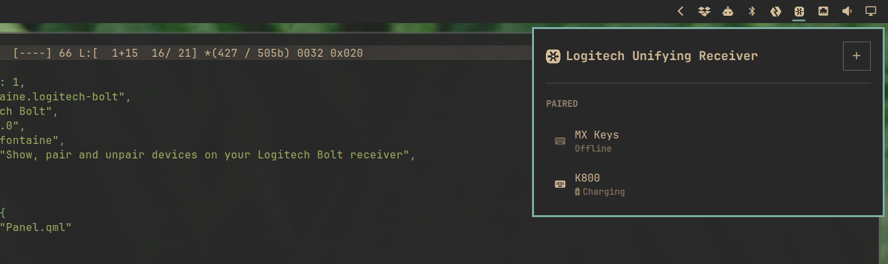

# Logitech Unifying

An [Omarchy](https://omarchy.org) shell plugin that shows the devices paired to your Logitech Unifying receiver right in the bar, and lets you pair or unpair them without needing Solaar or any other companion app.

Click the icon to see connected devices, their kind, and battery level. Put the receiver into pairing mode and unpair devices you no longer use — all from the panel.



## Install

```
omarchy plugin add https://github.com/axelfontaine/omarchy-logitech-unifying.git --enable
```

## Uninstall

```
omarchy plugin remove axelfontaine.logitech-unifying
```

## Permissions

Talking to the receiver requires read/write access to its `hidraw` device node, which isn't granted by default. If the panel shows a permission error, click the **Fix permissions** button inside it — it installs a udev rule (via a one-time authentication prompt) that grants your user access, no reboot required.

## Dependencies

No external dependencies. Everything needed to talk to the receiver is built in.

## Credit where credit is due

This would not have been possible without the hard work, reverse-engineering and dedication of the people behind [Solaar](https://github.com/pwr-Solaar/Solaar) who did the original heavy lifting to bring Logitech device support to Linux.

## License

MIT
